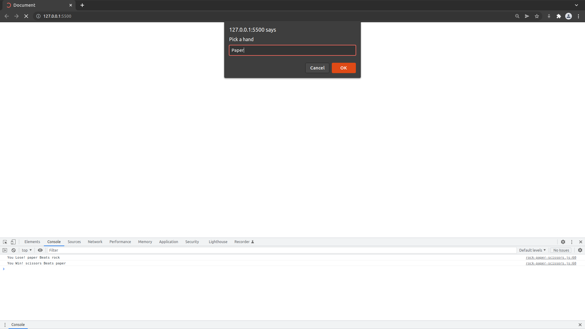

# Rock-Paper-Scissors

> Rock Paper Scissors game in JavaScript. Using console and prompts to play according to spec from The Odin Project: https://www.theodinproject.com/paths/foundations/courses/foundations/lessons/rock-paper-scissors

## Built With

- JavaScript

## Possible Improvements

- Capitilization of first letter of hands

## Live Link

[Live Link](https://cerdtruir.github.io/Rock-Paper-Scissors/)
Use F12 to open the console to see results

## Authors

👤 **Cerdtruir**

- GitHub: [@Cerdtruir](https://github.com/Cerdtruir)

## Acknowledgments

- The Odin Project

## 📝 License

This project is [MIT](./MIT.md) licensed.
